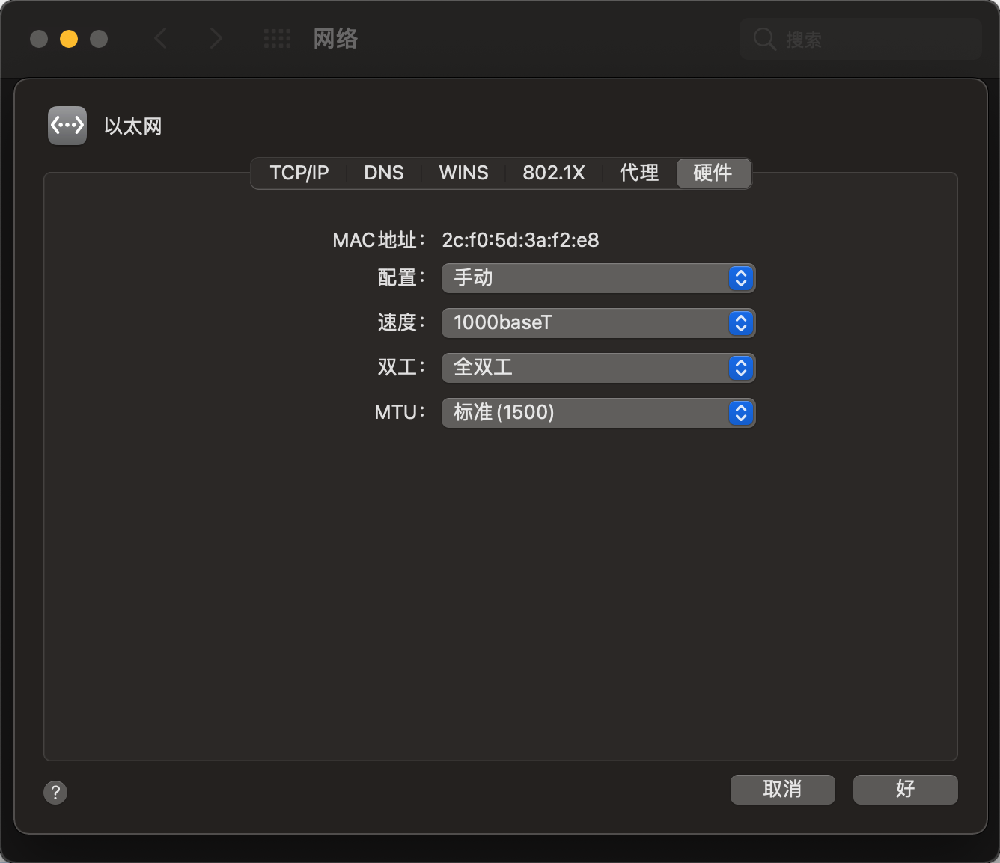
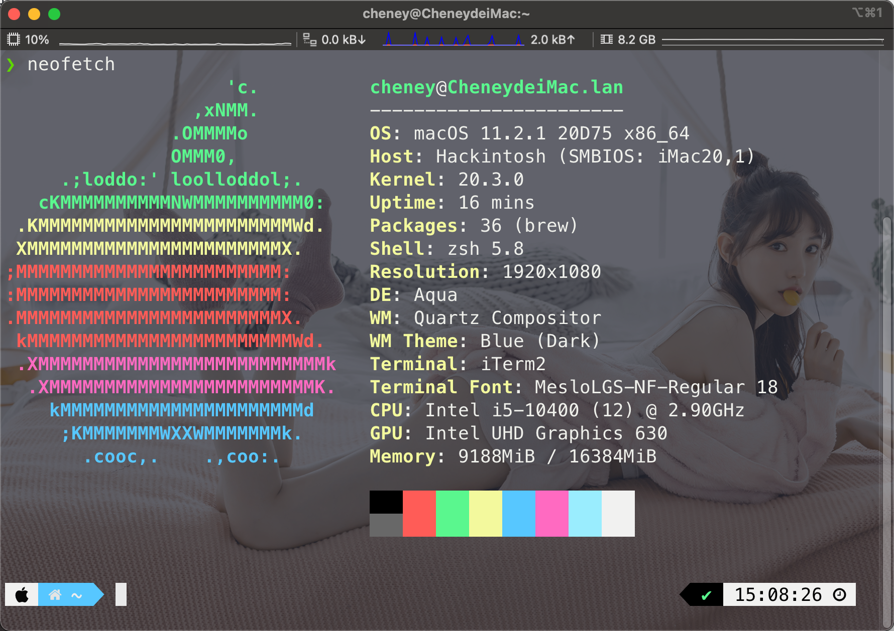
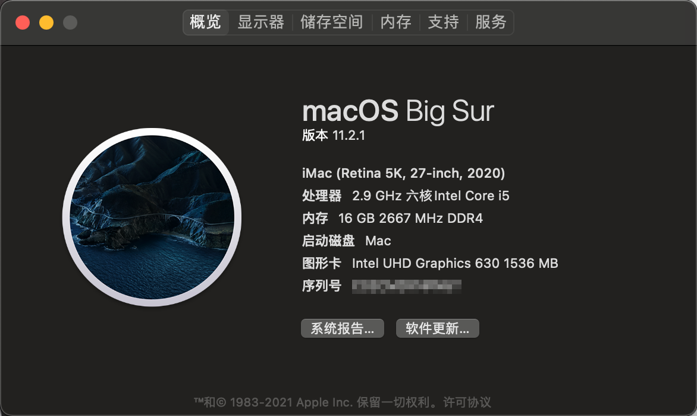
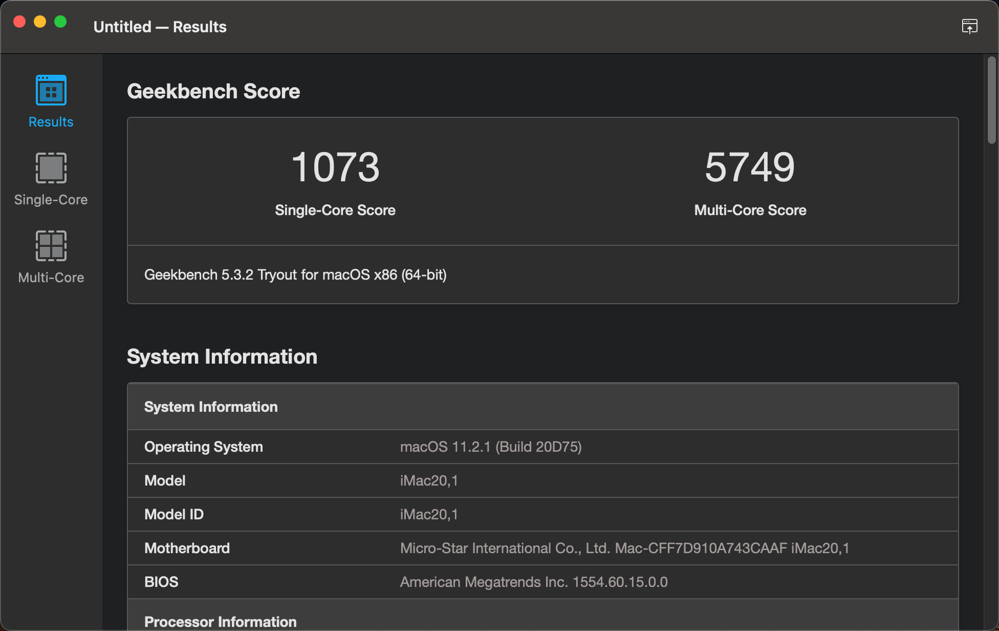
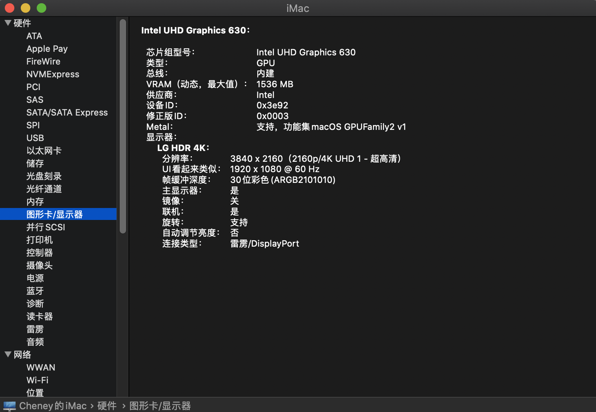

# Hackintosh-10400-B460M-MORTAR
## EFI 
OpenCore: 0.6.6

macOS version: 11.2.1

##  更新情况

2021.02.19

- 升级 OpenCore: 0.6.6
- macOS Big Sur 11.2.1

2021.01.08

- 升级 OpenCore: 0.6.5

2020.12.11

- 升级 OpenCore: 0.6.4

2020.11.5

- 升级 OpenCore: 0.6.3

2020.10.15

+ macOS 10.15.7 (19H2)

## 硬件配置
|组件|型号|
|------|------|
|主板|微星 B460M MORTAR|
|CPU|Intel i5 10400|
|内存|金士顿骇客神条RGB灯条 8GB * 2 2666MHz|
|显卡|Intel UHD Graphics 630 |
|SSD|铠侠 RC10 512GB|
|电源|振华冰山金蝶战斗版 450W|
|声卡|板载Realtek ALC1200|
|机箱|爱国者 M2 白色|
|散热|乔思伯CR-1000 + 乔思伯 FR-502-ARGB风扇 * 3|
|网卡|板载Realtek RTL8125B千兆网卡|

## Bios设置

## 网络设置

## 功能测试
- [x] 睡眠/唤醒
- [x] 所有USB端口
- [x] 核显硬件加速
- [x] 声卡输出
- [x] 以太网
- [x] DP 4K输出 

### 硬件识别正常

### 关于本机

### H264 和 HEVC 硬解

### Geekbench 5 跑分

### UHD630核显4k显示器DP输出

